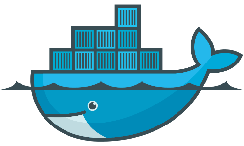

<h1> Hey! Nice to see you.</h1>

 

I am a versatilist and easily adapt to different hats (Full Stack Web Developer 🌐, Java Developer ☕) depending on what the project requires. I love exploring new tech stackand leveraging them to build cool stuffs. 
 
 

  
   
  
  
### 🧐 More About Me:

- 🔭 &nbsp; I’m currently working on **RUIPI**.
- 🌱 &nbsp; I’m currently learning ReactJs and NodeJS. 
- 👨🏻‍💻 &nbsp; Most of my projects are available on [Github](https://github.com/dflr10?tab=repositories).
- 💬 &nbsp; Ask me about anything tech related, I am happy to help;
- 📫 &nbsp; Feel free to ping me on [LinkedIn](https://www.linkedin.com/in/daniel-felipe-lozada-ramirez-28b239115/).
- 📝 &nbsp; Checkout my [portfolio](https://dflr10.github.io/Portafolio-Daniel-Lozada-Dev/).
- 🎮 &nbsp; When I am free, I like to play battle royale video games.

 
 
<h2>Only if you want it can you donate to me...<h2/>

 
 
  
### 🔨 Languages and Tools:

  

  

  

  

  
  
  

  

  

  

  

  

 

### 📊 Github Stats

 

### 🛠️ My Projects

